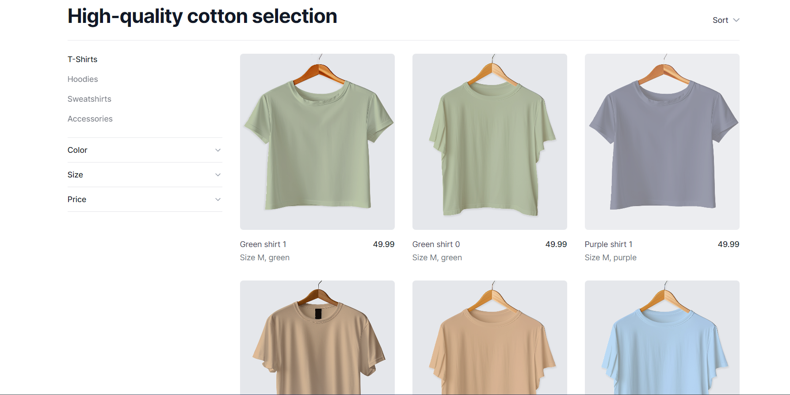
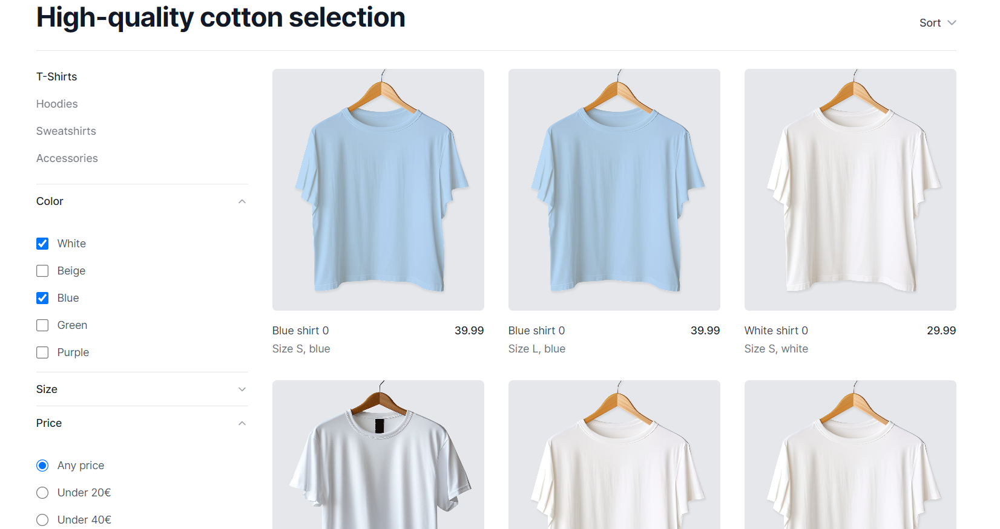
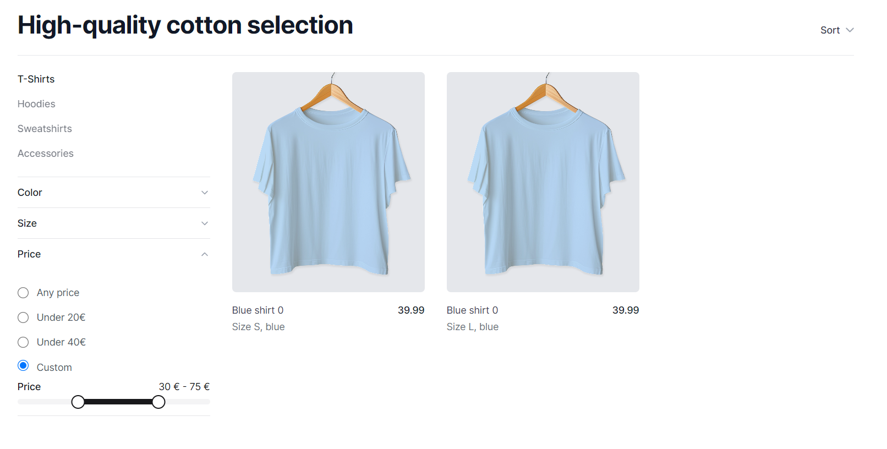

# SIFT

A single page product filtering application that filters products based on the parameters like size, color and price(custom pricing too) and sort them too.

Also used debounce timeout of 0.4s to prevent cooking up the API.

### Tech Stack:
- Next JS
- TypeScript
- Tailwind CSS
- Shad Cn Ui
- Lodash (Debounce)
- Upstash
- Tanstack React Query
- Zod

### Starting Date: 
    22nd April 2024

### Time Invested:
    8 hours

### Ending Date:
    28th April 2024

## Images:

# Steps to run the project:

1. Clone the repository: 
`git clone https://github.com/codecommander03/Sift.git`

2. Run `npm install`

3. Run `npm seed`

4. Run `npm run dev`

5. Open the browser and go to [Localhost 3000](http://localhost:3000)

6. Enjoy the application